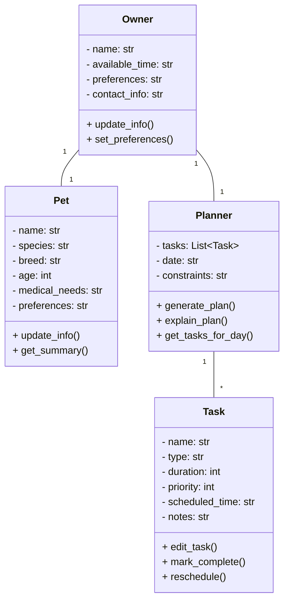

```mermaid
classDiagram
    class Pet {
        - name: str
        - species: str
        - breed: str
        - age: int
        - medical_needs: str
        - preferences: str
        + update_info()
        + get_summary()
    }
    class Owner {
        - name: str
        - available_time: str
        - preferences: str
        - contact_info: str
        + update_info()
        + set_preferences()
    }
    class Task {
        - name: str
        - type: str
        - duration: int
        - priority: int
        - scheduled_time: str
        - notes: str
        + edit_task()
        + mark_complete()
        + reschedule()
    }
    class Planner {
        - tasks: List~Task~
        - date: str
        - constraints: str
        + generate_plan()
        + explain_plan()
        + get_tasks_for_day()
    }
    Owner "1" -- "1" Pet
    Owner "1" -- "1" Planner
    Planner "1" -- "*" Task
```
