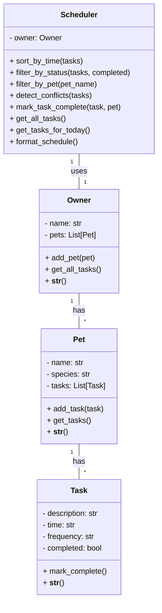

## Final UML Diagram

---

**How to render/export this diagram:**
- Go to https://mermaid.live
- Paste the code block above
- Click 'Export' > 'Download as PNG'
- Save as uml_final.png in your project folder
